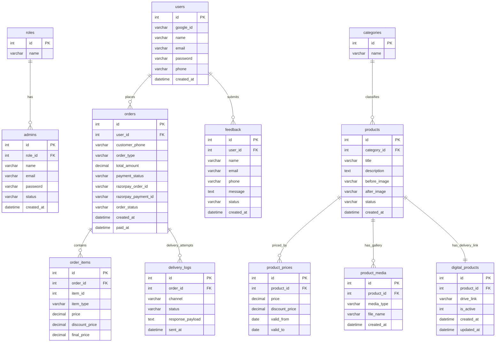
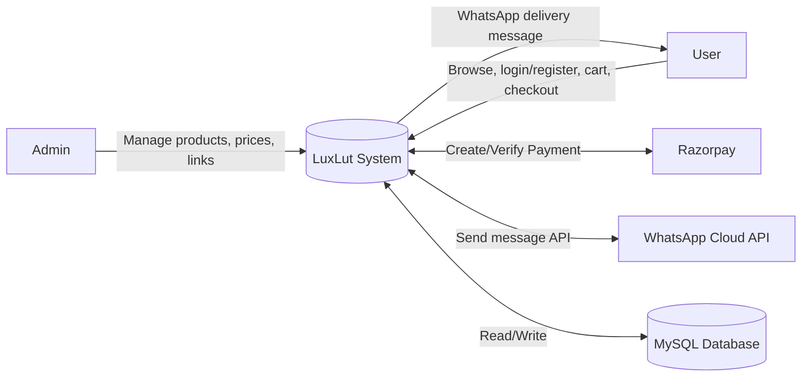
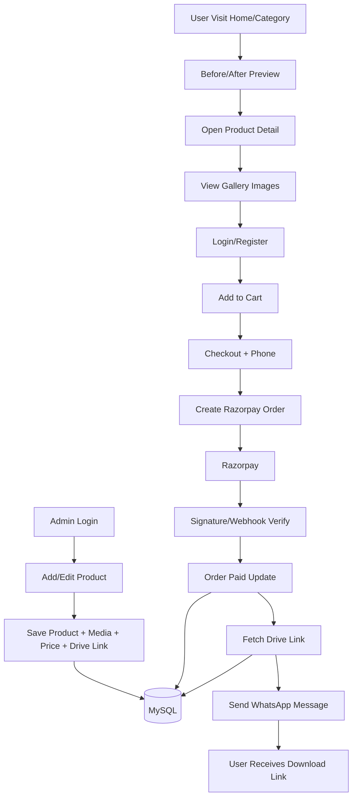

# LuxLut - Preset & LUT Digital Seller Platform

A production-style PHP + MySQL project for selling Lightroom Presets and LUTs with:
- Before/After discovery on home/category
- Product gallery browsing
- Cart + Checkout + Razorpay payment flow
- WhatsApp-based secure delivery (Drive links)
- Admin panel for products, orders, users, and feedback

This guide is written for beginners (including college students) using **XAMPP + VS Code**.

---

## 1. Quick Links (Downloads)

- XAMPP (Apache + MySQL + phpMyAdmin): https://www.apachefriends.org/
- VS Code: https://code.visualstudio.com/
- Git (optional, for cloning): https://git-scm.com/downloads

---

## 2. Tech Stack

- Backend: PHP (procedural + helper-based structure)
- Database: MySQL / MariaDB
- Frontend: HTML, CSS, Bootstrap 5, vanilla JS
- Payment: Razorpay API + signature verification
- Auth: Email/Password + Google OAuth
- Delivery: Meta WhatsApp Cloud API

---

## 3. Project Structure

```text
luxlut/
+-- admin/                    # Admin panel (dashboard, products, orders, users, feedback)
+-- assets/uploads/           # Uploaded product images
+-- backend/
|   +-- config/               # DB, constants, env loader
|   +-- helpers/              # Common helpers (csrf, redirect, cart utils)
|   +-- integrations/         # WhatsApp client
|   `-- payments/             # Razorpay create/verify/webhook
+-- database/
|   +-- schema_presets.sql    # Fresh install schema
|   `-- migrations/           # Conversion migration(s)
+-- frontend/
|   +-- auth/                 # Login, register, Google callback
|   +-- includes/             # Shared header/footer/config
|   `-- *.php                 # Home, category, product, cart, checkout, contact, feedback
+-- .env
`-- index.php                 # Entry point -> frontend/home.php
```

---

## 4. Prerequisites

- Windows/macOS/Linux
- PHP 8.0+ (XAMPP already provides this)
- MySQL/MariaDB running
- Apache running

---

## 5. Step-by-Step Setup (XAMPP + VS Code)

## Step 1: Put project inside `htdocs`

Copy project folder to:

```text
C:\xampp\htdocs\luxlut
```

## Step 2: Start Apache and MySQL

Open **XAMPP Control Panel**:
- Start `Apache`
- Start `MySQL`

## Step 3: Open project in VS Code

- Open VS Code
- `File -> Open Folder -> C:\xampp\htdocs\luxlut`

## Step 4: Configure `.env`

Copy `.env.example` to `.env` (if not already done), then keep/update:

```env
APP_NAME=LuxLut
APP_DEBUG=1
APP_BASE_URL=/luxlut/

DB_HOST=localhost
DB_PORT=3306
DB_NAME=wedding_studio
DB_USER=root
DB_PASS=

GOOGLE_CLIENT_ID=
GOOGLE_CLIENT_SECRET=
GOOGLE_REDIRECT_URI=http://localhost/luxlut/frontend/auth/callback.php

RAZORPAY_KEY_ID=
RAZORPAY_KEY_SECRET=
RAZORPAY_WEBHOOK_SECRET=

WHATSAPP_TOKEN=
WHATSAPP_PHONE_NUMBER_ID=
WHATSAPP_VERIFY_TOKEN=
WHATSAPP_DEFAULT_COUNTRY=91
```

## Step 5: Create database

1. Open `http://localhost/phpmyadmin`
2. Create DB: `wedding_studio`

## Step 6: Import SQL (choose one)

### Option A: Fresh Install (recommended)

Import:

```text
database/schema_presets.sql
```

### Option B: Existing old wedding DB conversion

Run migration:

```text
database/migrations/2026_02_24_presets_conversion.sql
```

## Step 7: Create first admin user

If `admins` table is empty, run this in phpMyAdmin SQL tab:

```sql
INSERT INTO admins (role_id, name, email, password, status, created_at)
VALUES (
  1,
  'Main Admin',
  'admin@luxlut.com',
  '$2y$10$gqh5ji4PFxt8xq7dUIe2suE1Vx9yNR6Gf8qwMCN/NavNml9a/czfa',
  'active',
  NOW()
);
```

Login credentials:
- Email: `admin@luxlut.com`
- Password: `Admin@123`

## Step 8: Run in browser

- Frontend: `http://localhost/luxlut/`
- Admin login: `http://localhost/luxlut/admin/index.php`

---

## 6. Core Functional Flow

1. Admin adds product:
   - Title, description, category, price
   - Before image + After image (for discover pages)
   - Gallery images (for product page)
   - Drive link (stored in `digital_products`)
2. User browses products, logs in/registers, adds cart, checks out.
3. Razorpay payment success updates order status.
4. System sends download link via WhatsApp.

---

## 7. ERD (Entity Relationship Diagram)


---

## 8. DFD (Data Flow Diagram)

## Level 0 (Context Diagram)



## Level 1 (Main Process Flow)



---

## 9. Important URLs

- Home: `/luxlut/`
- Login: `/luxlut/frontend/auth/index.php`
- Register: `/luxlut/frontend/auth/register.php`
- Product detail: `/luxlut/frontend/product.php?id={id}`
- Feedback: `/luxlut/frontend/feedback.php`
- Admin: `/luxlut/admin/index.php`
- Admin Feedback: `/luxlut/admin/feedback/list.php`

---

## 10. API / Backend Endpoints

- `POST /backend/payments/create_order.php`
- `POST /backend/payments/verify_signature.php`
- `POST /backend/payments/webhook.php`
- `POST /frontend/auth/register_process.php`
- `POST /frontend/auth/login_process.php`
- `POST /frontend/feedback_process.php`

---

## 11. Basic QA Checklist

- [ ] User can register with name/email/phone/password
- [ ] User can login via email/password
- [ ] User can login via Google (if configured)
- [ ] Home page shows before/after compare
- [ ] Product page shows gallery-only preview
- [ ] Cart and checkout work for logged-in users
- [ ] Razorpay verify endpoint updates order as paid
- [ ] WhatsApp delivery log is created
- [ ] Feedback form submits successfully
- [ ] Admin can view feedback and mark reviewed

---

## 12. Common Issues

## `Error 400: redirect_uri_mismatch` (Google login)

- Ensure `.env` value and Google Console Authorized Redirect URI are exactly same:
  - `http://localhost/luxlut/frontend/auth/callback.php`

## Console spam like `/hybridaction/zybTrackerStatisticsAction` 404

- Usually browser extension issue, not app code.
- Test in Incognito or disable conflicting extension.

---

## 13. Screenshots (Add in Future)

Create folder:

```text
docs/screenshots/
```

Then replace placeholders:

```md
## Screenshots


```

---

## 14. License

For academic/demo use. Add your preferred license file (`MIT`, `Apache-2.0`, etc.) before public release.
